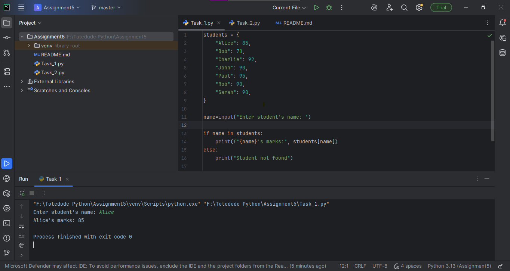
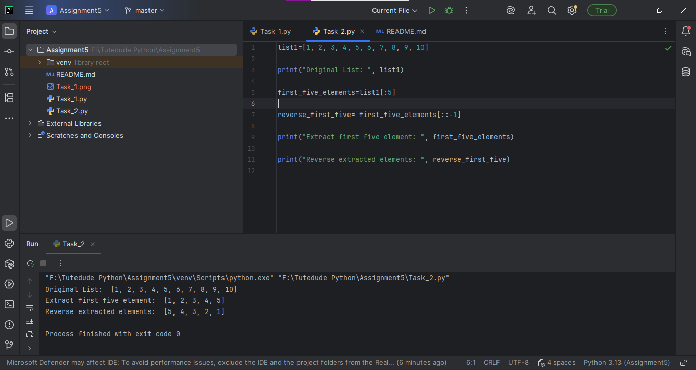

# Assignment 5 - Data Structures and Strings in Python

This repository contains my solutions for Assignment 5.  
Below are the screenshots of outputs for each task:

## Screenshots

| Task    | Screenshot                   |
|---------|------------------------------|
| Task 1  |  |
| Task 2  |  |
